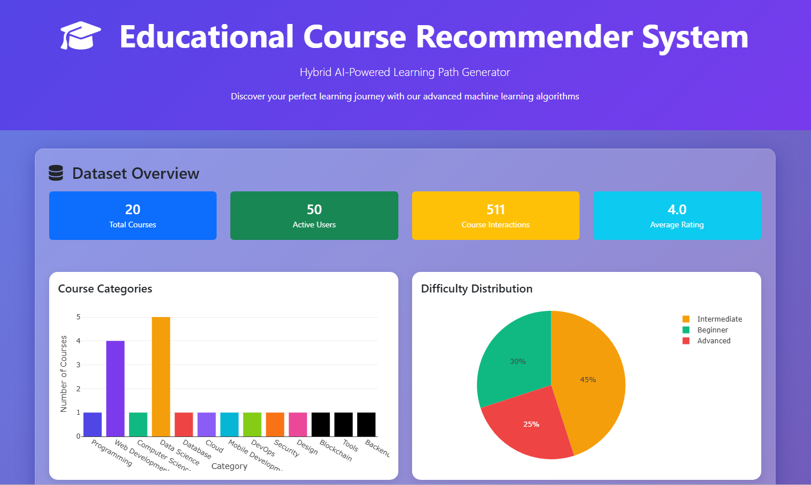
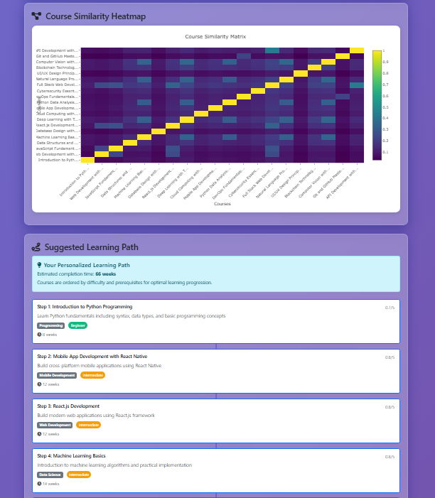
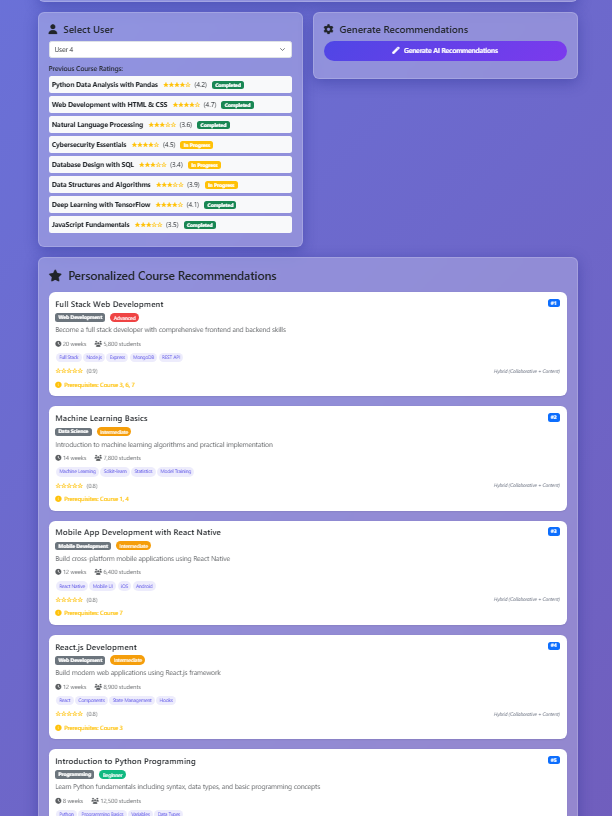

# Educational Recommender System 🎓

> A fully functional, browser-based educational course recommender system using **hybrid AI algorithms** (Collaborative Filtering + Content-Based Filtering) implemented with TensorFlow.js. No installation or server required!

---
 

 
---

## Features

- Hybrid recommendation combining collaborative filtering (TensorFlow.js matrix factorization) and content-based filtering (cosine similarity)
- Real-time model training and prediction entirely in-browser using CDN libraries
- Sample dataset with 20 courses and 50 users with ratings and completion data
- Interactive UI with Bootstrap 5 and elegant visualization via Plotly.js
- Dynamic learning path generation considering prerequisites and difficulty levels
- Responsive and modern design featuring glassmorphism styling
- Clear explanations and recommendation source indicators (Collaborative, Content-Based, Hybrid)

---

## Getting Started

1. Open the live demo link above or download the source and open `index.html` locally.
2. Select a user profile from the dropdown or choose “New User” for a cold-start experience.
3. View user’s past course ratings and completions.
4. Click **Generate Recommendations** to train the model and get personalized course recommendations.
5. Explore course details, similarity heatmaps, and suggested learning paths.

---

## Technical Details

- **Machine Learning Engine:** TensorFlow.js 4.11.0 (Matrix factorization for collaborative filtering)
- **UI Framework:** Bootstrap 5.3.2 (Responsive components)
- **Visualization:** Plotly.js 2.27.0 (Charts and heatmaps)
- **Data:** Embedded JSON with courses metadata and user interactions
- **Training Configuration:** 50 epochs, batch size 32, Adam optimizer, MSE loss
- **Hybrid Weights:** Default 60% Collaborative, 40% Content; Cold start 30% Collaborative, 70% Content

---

## System Requirements

- Modern web browser with JavaScript and WebGL enabled (Chrome, Firefox, Edge, Safari)
- Internet connection required for CDN resources
- Approximately 5-10 seconds for model training in-browser

---

## Contributing

Contributions are welcome in the following areas:

- Adding new course datasets and user profiles
- Enhancing recommendation algorithms or tuning parameters
- UI/UX improvements and accessibility features
- Performance optimization and offline capabilities
- Extending learning path generation logic

---

*Enjoy personalized learning with AI-powered course recommendations at your fingertips!* 🚀🎓
